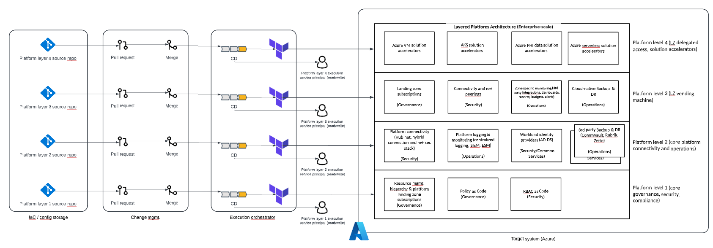

# Contributor guide

> **Note:** this documentation is a work-in-progress - if you see something that's not quite right or missing, we'd really appreciate a PR!

When contributing to this project please follow guidane to help speed up testing and acceptance of your changes.

This contribution guide assumes you have at least a basic understanding of PowerShell and [Terraform](https://www.terraform.io/docs/language/index.html).

---

## Basics

* [Overview of the Project](#overview)
* [Project structure](#project-structure)
* [Design](docs/reference-design.md)
* [Building the Project](README.md#build)
* [Opening a PR](docs/guide-opening-a-pr.md)
* [Creating an Issue](docs/guide-creating-an-issue.md)
* [Deployment workflow](#deployment-workflow)

## References

* [Folder and file names](#folder-and-file-names)
* [Markdown coding syntax](#markdown-coding-syntax)
* [Terraform coding syntax](#terraform-coding-syntax)

---

## Overview

TODO

---

## Project structure

### Top-level directory layout

    .
    └── platform-layer-0
        ├── .vscode                 # IDE workspace config files
        ├── docs                    # Documentation files
        ├── infra                   # Infrastructure as Code source files
        ├── scripts                 # Scripted workflows
        ├── tests                   # Automated tests
        ├── CONTRIBUTING      
        ├── LICENSE
        └── README.md

### Infrastructure as Code (IaC) directory layout

    .
    └── infra                       # Infra as Code source files
        ├── governance              # CSP Governance resources and configuration
        ├── identity                # IdP resources and configuration
        ├── orchestration           # DevOps resources and configuration
        └── security                # CSP Security resources and configuration

---

## Deployment workflow

### Guiding principles
* Deployment model should align with layered reference architecture
* Each layer is a security boundary
* Isolate state mgmt. per layer (one storage account, blob container per layer, scope RBAC to container)
* Isolate identity per layer (Azure AD SP per layer) 
* Layers 1 - 2 will deploy core platform services and workloads.  
* Layer 3 will deploy requested cloud landing zone subscriptions and fundamental services
* Layer 4 will deploy delegated access and solution accelerators to specificed landing zones 

---

## Coding syntax references

### Folder and file names
Files and folders should be named consistently.
* Short but descriptive (<25 characters)
* Avoid special characters and spaces
* Use this formating: two-words (`kebab-case`)
* If using date, use date format ISO 8601: YYYYMMDD
* Include a version number if applicable

### Markdown coding syntax

* [Online referene](https://www.markdownguide.org/basic-syntax)

### Terraform coding syntax

TODO

