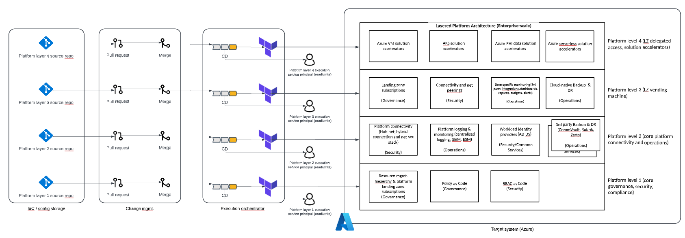
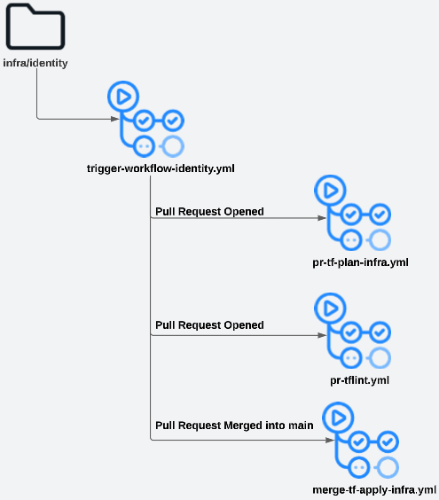

# Public Cloud Platform Starter Kit

> **Note:** this documentation is a work-in-progress - if you see something that's not quite right or missing, we'd really appreciate a PR!

Build a cloud-native application, data, and cloud services hosting platform using Infrastructure as Code and GitOps best practices.

## Platform user-centric features and benefits

1. feature a
2. feature b
3. feature c

## Platform capabilites (these enable features above)

1. capability a
2. capability b
3. capability c

## Roadmap

1. Future feature x by implementing capability y, and z.

## Codebase structure (today)
Single code repo per platform level, each repo includes both level-specific deployment (live) script and custom module code.  

    .                           
    └── platform-level-[x]          # One repo per platform leve
        ├── .github                     # GitHub configs
        |   └── workflows                   # Action configs
        ├── .vscode                     # VS Code workspace configs
        ├── docs                        # Repo docs
        ├── scripts                     # Script code
        ├── tflint                      # Tflint configs          
        └── infra                       # Infra deployment scripts (live)
            ├── automation               
            ├── governance-finops
            ├── governance-mgmt             # Tech domain deployment
            |   ├── main.tf                     # Deployment script
            |   ├── output.tf                   # Deployment output
            |   ├── provider.tf                 # Deployment provider
            |   ├── README.md                   # Deployment documentation
            |   ├── terraform.tfvars            # Deployment variable values
            |   └── variables.tf                # Deployment variables     
            ├── identity                 
            ├── operations-logging
            ├── operations-monitoring
            ├── operations-bcdr            
            ├── network                 
            ├── security                           
            └── modules                 # Module code
                └── policy-assignment       # Storage resource modules
                    ├── example                 # Module usage examples
                    |   └── example.tf              # Example deployment script
                    ├── main.tf                 # Module template
                    ├── output.tf               # Module outputs
                    ├── README.md               # Deployment documentation
                    └── variables.tf            # Module variables

## Codebase structure (future state)
Single code repo per platform level, each repo includes level-specific deployment template (live) script code. Single code repo per custom module. 

    .
    └── platform-level-[x]          # One repo per platform level
        ├── .github                     # GitHub configs
        |   └── workflows                   # Action configs
        ├── .vscode                     # VS Code workspace configs
        ├── docs                        # Repo docs
        ├── scripts                     # Script code            
        └── infra                       # Infra deployment scripts (live)
            ├── [ repo ]                    # Per code repo deployments [see design]
            └── [ cloud-provider ]          # CSPs [aws, azure, gcp, github]
                ├── [ mgmt-group ]          # Per mgmt. group deployments [see design]
                |   ├── main.tf                 # Deployment script
                |   ├── output.tf               # Deployment output
                |   ├── provider.tf             # Deployment provider
                |   ├── README.md               # Deployment documentation
                |   ├── terraform.tfvars        # Deployment variable values
                |   └── variables.tf            # Deployment variables   
                └── [ region ]              # Per region deployments [see design]
                    ├── automation              
                    ├── governance-finops       # Tech domain deployment
                    ├── identity                 
                    ├── operations-logging
                    ├── operations-monitoring
                    ├── operations-bcdr            
                    ├── network                 
                    └── security
    
    .
    └── module-azure-policy-assignment          # One repo per module
        ├── .github                                 # GitHub configs
        |   └── workflows                               # Action configs
        ├── .vscode                                 # VS Code workspace configs
        ├── docs                                    # Repo docs
        ├── example                                 # Module usage examples
        |   └── example.tf                              # Example deployment script
        ├── scripts                                 # Script code 
        ├── main.tf                                 # Module template
        ├── output.tf                               # Module outputs
        └── variables.tf                            # Module variables

## Platform deployment

### Guiding principles
* Deployment model should align with layered reference architecture
* Each layer is a security boundary
* Isolate state mgmt. per layer (one storage account, blob container per layer, scope RBAC to container)
* Isolate identity per layer (Azure AD SP per layer) 
* Layers 1 - 2 will deploy core platform services and workloads.  
* Layer 3 will deploy requested cloud landing zone subscriptions and fundamental services
* Layer 4 will deploy delegated access and solution accelerators to specificed landing zones

### Platform GitOps Workflow

### GitHub Actions CI/CD Worklfow

## Deployment requirements

### Software

* Git
* Terraform
* Azure CLI

This project has been tested with the following versions of required software:

    Git         v2.39.2
    Terraform   v1.4.x  - <v2.0.0
    Azure CLI   v2.47.0

### Access

* GitHub Organization (Org. admin and repo admin roles)
* Azure AD Tenant (Azure AD app and group admin role)
* Azure (Owner role at root group scope)
* Azure billing account (Invoice section owner role at invoice section scope)

## Development and contributing  

[Developer guide](docs/guide-development.md)

[Contributor guide](CONTRIBUTING.md)